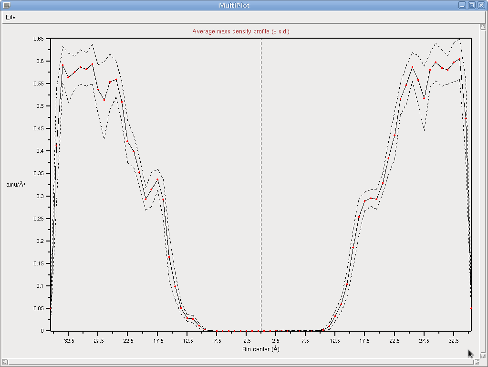
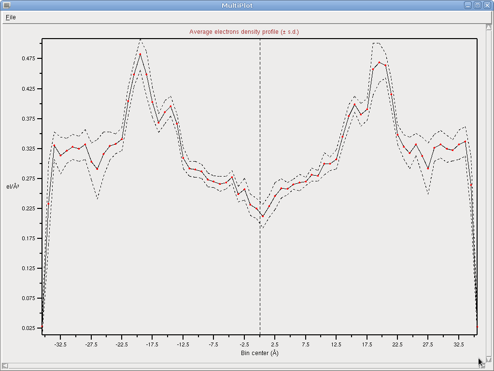

VMD Density Profile Tool (1.3)
==============================

The *Density Profile Tool* is a VMD analysis plugin that computes 1-D projections of various atomic densities. The computation can be performed in a single frame, a trajectory, or averaged over multiple frames.

-   Atomic (number) density, i.e. average number of atoms

-   Mass density

-   Charge density

-   Electron density, i.e. number density of electrons.

This tool is fully described in the reference given below. This page serves only as a quick-reference.

Installation
----------------------------------------

See instructions [here](https://gist.github.com/tonigi/a9cfaf7642a7fbc13293).

**NOTE: This code comes without any warranty of fitness for any use. It is UNSUPPORTED. After you download it, you are on your own.** By downloading the software you agree to comply with the terms of the
3-clause BSD license.
 

You may or may not be able to get support by posting to the [External tools](https://sourceforge.net/p/membplugin/discussion/external_tools/) forum hosted at the [MEMBPLUGIN](http://membplugin.sourceforge.net) site.

Citation
--------

Please cite the following publication:

-   Toni Giorgino, Computing 1-D atomic densities in macromolecular simulations: the Density Profile Tool for VMD, *Computer Physics Communications* Volume 185, Issue 1, January 2014, Pages 317–322, [doi:10.1016/j.cpc.2013.08.022](http://dx.doi.org/10.1016/j.cpc.2013.08.022) – [arXiv:1308.5873](http://arxiv.org/abs/1308.5873)

Usage (GUI)
-----------

The plugin is accessible from VMD in *Extensions \> Analysis \> Density Profile Tool*. By default, the profile is computed for the current frame in the *top* molecule. For mass and charge computation, a topology file must be loaded.

When dealing with a trajectory, the behaviour depends on the *average* check box: if selected, density profiles for all of the frames will be plotted; otherwise, the average plus or minus the standard deviation will be displayed.

If periodic cell information is available in the molecule (e.g. as set in *pbctools*), the density will be properly normalized with respect to the volume. Otherwise, it will be simply projected along a linear axis. **IMPORTANT: you will still need to wrap the trajectory yourself.**

*Electron density* calculations require the atomic number *Z* (i.e., the element) to be known for each atom. This information may be obtained from either the *mass*, *name*, *type*, or *element* atom properties (see VMD manual). Selecting ***mass* is highly recommended** because *element* is usually unset, and guessing from *type* or *name* requires error-prone heuristics. Atomic number guessing is based on the [topotools guessatom](http://www.ks.uiuc.edu/Research/vmd/plugins/topotools/#TOC-guessatom-property-from-) function and algorithm. Note that the heuristics will likely be inappropriate in the case of united atom/coarse grain forcefields.

Usage (command line)
--------------------

A command line interface is available to perform the same calculations as the GUI. See help with

    vmd > package require density_profile
    vmd > density_profile

    Usage: density_profile <args>
    Args (with defaults):
       -rho electrons
       -selection name P11
       -axis z
       -resolution 1
       -Zsource type
       -partial_charges 1
       -frame_from 0
       -frame_to 130
       -frame_step 1
       -average 1

Where `-rho` is one of *number, mass, charge* or *electrons*. In the latter case, `-Zsource` must be one of *mass, element, name, type*. The function returns two lists:

-   The **lower coordinate** of each bin, i.e. a list of bin breaks.

-   A list of **densities for each bin**. Each element of the list is

    -   a single value, if only one frame is selected, or *average* is 1

    -   a list of density values, one for each of the frames computed

**IMPORTANT: when used on the command line, bin BREAKS are returned. When plotting, dots are placed in bin CENTERS.**

Units
-----

Assuming that periodic box information is available, results are given in the following units:

-   Atomic density: atoms/Å3

-   Mass density: amu/Å3=Da/Å3

-   Charge density: e/Å3

-   Electron density: electrons/Å3

**Unit conversions:**

-   in moles per liter, multiply by 1661 ų mol/l (or the value appropriate at your temperature)

-   1 amu/Å3 = 1.66 g/cm3 = 1660 kg/m3

Example
-------

See attached screenshots. 

Solvent density profile around a POPC membrane. Note how the water density in bulk goes to the macroscopic value of 18/30 amu/ų.

Electron density profile of a POPC membrane (solvent included).

Limitations
-----------

-   Atoms are assumed as point-like;

-   only orthorhombic cells are supported;

-   to compute volumetric densities, cell information must be present for *all* frames.

Acknowledgments
---------------

Former support from the Agència de Gestió d'Ajuts Universitaris i de Recerca - Generalitat de Catalunya is gratefully acknowledged.

